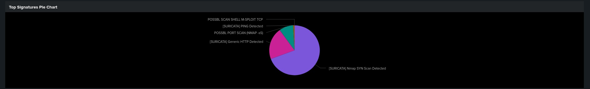
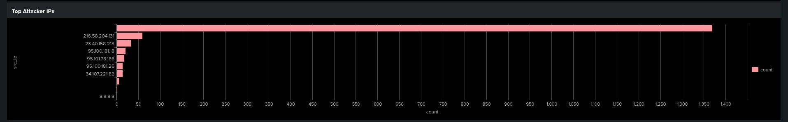
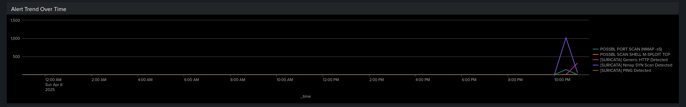
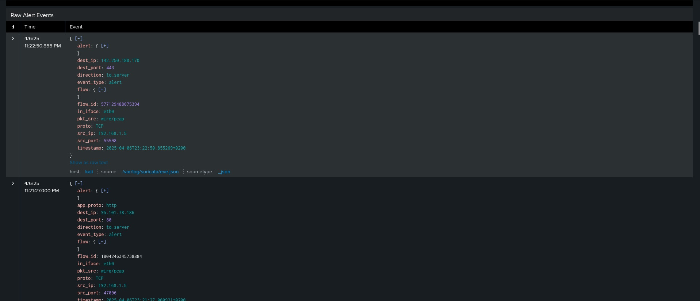
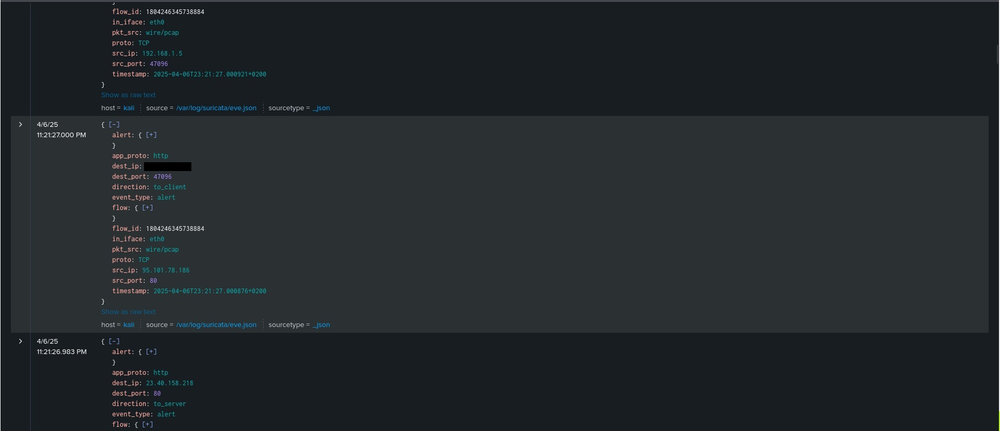
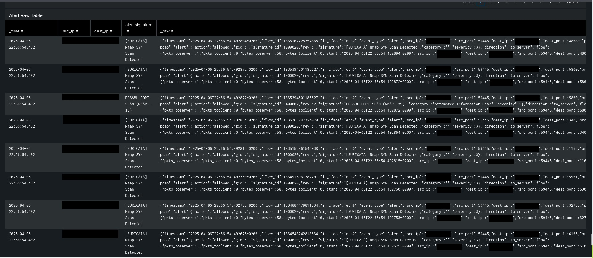

Questo progetto fa parte del mio percorso di formazione in cybersecurity, focalizzato sull’analisi del traffico di rete e la rilevazione di minacce tramite l’IDS Suricata.

**Obiettivo**
Creare una **dashboard Splunk** per analizzare gli alert generati da Suricata in seguito a simulazioni di attacchi, con l'obiettivo di:

- Allenarmi all'analisi di traffico sospetto
- Comprendere le tecniche di attacco rilevabili tramite IDS
- Costruire un portfolio tecnico orientato alla sicurezza delle reti

  **Tecnologie utilizzate**
- Kali Linux (VirtualBox)
- Suricata IDS/IPS
- Splunk Enterprise
- Bash scripting

**Attacchi simulati**
Tramite comandi e strumenti di test (es. Nmap, ping flood, wget) ho generato eventi per attacchi comuni come:

- Scansioni di porte TCP (Nmap SYN, sS, ecc.)
- Ping (ICMP echo)
- Download sospetti su HTTP/HTTPS
- SQL injection simulata
- Comportamento HTTP anomalo

**Suricata Dashboard**
La dashboard include i seguenti pannelli:

Pannello | Descrizione 

**Dashboard Principale** Elenco degli alert in ordine temporale e per tipo 

**Top Signatures Pie Chart** Grafico a torta con la distribuzione delle firme Suricata rilevate 

**Top Attacker IPs** Classifica degli IP che hanno generato più eventi di alert 

**Alert Trend Over Time** Timeline con l’andamento degli alert nel tempo (ottimo per osservare picchi anomali) 

**Alert Raw Table** Tabella con eventi arricchiti: IP sorgente, destinazione, porta e firma rilevata 

**Raw Alert Events** Visualizza gli eventi raw direttamente da `eve.json`, con tutti i dettagli del pacchetto 

Questa repository **non contiene log JSON** o `.pcap` completi per motivi di privacy, ma include regole personalizzate e screenshot della dashboard.
